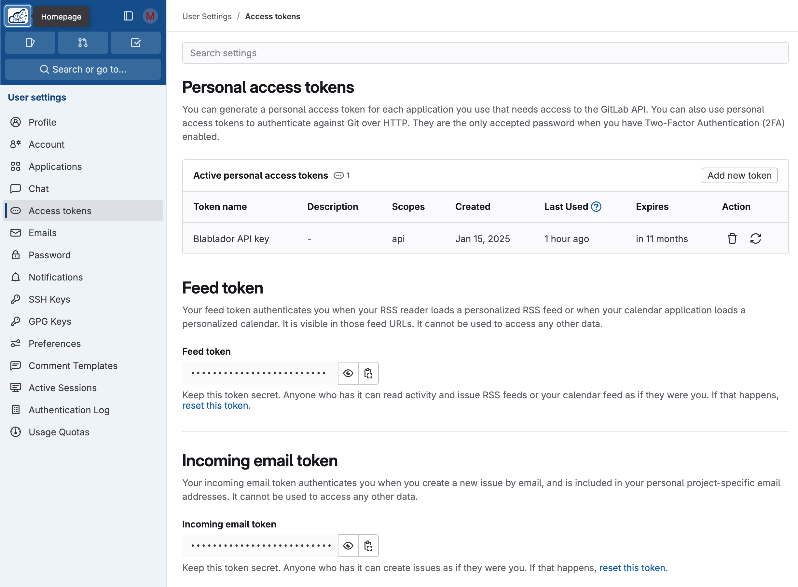

# Setting up your computer

This chapter provides instructions for preparing your computer for the training school. It is recommended to install a VPN client as described below **days before** the training. In case of issues, please reach out to the training organizers.

## VPN and access to the HPC cluster 

During the training school, you will have access to the [High Performance Computing (HPC) infrastructure](https://compendium.hpc.tu-dresden.de/) of TU Dresden to run the tutorial notebooks. To connect to HPC, you need to set-up a connection to TU Dresden [VPN](https://tu-dresden.de/zih/dienste/service-katalog/arbeitsumgebung/zugang_datennetz/vpn?set_language=en). 

It is recommended to install the [eduVPN](https://www.eduvpn.org/) client, which is available for all major operating systems. To install eduVPN, [download the client](https://www.eduvpn.org/client-apps/) for your operating system and follow the instructions provided.

To set-up the VPN connection via eduVPN, a TUD guest account will be provided on the first day of the training. With this available, follow the [instructions provided](https://faq.tickets.tu-dresden.de/otrs/public.pl?Action=PublicFAQZoom;ItemID=1284). 

The HPC cluster / Jupyter Hub is then accessible via https://jupyterhub.hpc.tu-dresden.de (provide the same TUD guest account credentials as for the VPN).

## Setting-up your workspace

This will be done together on the first day of the training school.

1. Connect to TUD VPN and go to https://jupyterhub.hpc.tu-dresden.de to log in with your training account
2. Use the provided spawn links to allocate HPC resources and spawn a Jupyter Lab server
3. After being assigned a spot on the HPC cluster, you will be greeted by a Jupyter Lab environment.
4. Open a terminal and copy a Juypter notebook for HPC setup to your home dir:
  * `cp /projects/p_scads_trainings/iom-ai/HPC-setup.ipynb .`
5. Close the terminal. In the file browser on the left side, click the refresh icon and open `HPC-setup.ipynb` 
6. When asked to "Select Kernel", leave the default Python 3 kernel and click "Select".
7. Do the steps explained in the notebook.

This setup is only required once. 

For subsequent sessions, you just follow steps 1 & 2 to start Jupyter Lab.

## Registration at Helmholtz Blablador

In the  training school, we also want to take a short look at how Large Language Models (LLM) and AI chatbots based on them can support us in coding and data analysis. Helmholtz-Jülich provides a free LLM service for researchers called "[Blablador](https://helmholtz-blablador.fz-juelich.de/)". In order to use this service, prior registration and creation of an API key are necessary.

Please follow the steps on [this website](https://sdlaml.pages.jsc.fz-juelich.de/ai/guides/blablador_api_access/) as described:

1. **Register at Helmholtz Gitlab (Codebase)**
* Open the [Helmholtz Codebase](https://codebase.helmholtz.cloud/users/sign_in)
* Log in via "Sign in with Helmholtz ID" and select your university to authenticate with your university account

**ATTENTION:** if you experience "OIDC error" or "authentication failed", your institute does not seem to provide a working OIDC configuration to authenticate at Helmholtz Codebase. You may try to authenticate using Github instead, given you have a Github account.

2. **Create an API Key (Token)**
* _ATTENTION: this API key should be treated like a personal password and should not be made available to anyone else!_
* Open your [profile page](https://codebase.helmholtz.cloud/-/profile/preferences)
* Select "Access Token" on the left side
* Under "Personal access tokens", create a new token via "Add new token"
* Name it best "Blablador API key"
* Select "api" as scope
* Copy the displayed key and save it securely (e.g. password manager) - it will not be displayed again after confirmation

## Optional for local execution

### Setting up Python and virtual environments with Conda

**NOTE:** As preparation of the course you do not need to install Python or Conda on your computer because we will work in a remote HPC environment where you get access to. However, _in case_ you want to play with the notebooks and tools on your own computer, follow the instructions below.

**Background**: When working with Python, we will make use of software libraries (packages) for additional functionalities like Machine Learning, which need to be organized. One way of doing this is by managing virtual Python environments, and one tool to do this is [*Conda*](https://docs.conda.io/projects/conda/en/latest/user-guide/getting-started.html). A virtual environment can be considered a virtual desktop or virtual computer and is accessible via the terminal and other software once it has been activated. If you install packages into one virtual environment, it may not be accessible from another environment. If a virtual environment breaks, e.g. incompatible packages were installed, you can just remove it and start over.

See also
* [Conda CheatSheet](https://docs.conda.io/projects/conda/en/stable/user-guide/cheatsheet.html)
* [Getting started with Mambaforge and Python](https://biapol.github.io/blog/mara_lampert/getting_started_with_mambaforge_and_python/readme.html)
* [Managing Scientific Python environments using Conda, Mamba and friends](https://focalplane.biologists.com/2022/12/08/managing-scientific-python-environments-using-conda-mamba-and-friends/)
* [Scientific Data Analysis with Python](https://youtu.be/MOEPe9TGBK0)

#### Step 1: Install Conda-forge / Miniforge
We recommend the small-footprint Conda distribution [miniforge](https://conda-forge.org/download/). For ease-of-use, it is recommended to install it for your user only and to **add Conda to the PATH variable** during installation. 

Please refer to the [official installation instructions](https://github.com/conda-forge/miniforge)!

Check whether conda is available in your terminal via `conda --version`

#### Step 2: Create virtual environment with all packages

Since we are going to use the deep learning frameworks [pytorch](https://pytorch.org/) and [tensorflow](https://www.tensorflow.org/) for the sessions, and both do cause problems when installed in the same environment, you should prepare separate environments for both.

**Download Files**
* Download both Conda configuration files, which defines the according environment: 
  * [conda-iom-env-torch.yml](conda-iom-env-torch.yml)
  * [conda-iom-env-tensorflow.yml](conda-iom-env-tensorflow.yml)

**Create Virtual Environments**
* Open a terminal or command prompt
* Navigate to the file’s location
* Execute this commands to install both environments: 
  * `conda env update -f conda-iom-env-torch.yml --prune`
  * `conda env update -f conda-iom-env-tensorflow.yml --prune`
* With this command:
  * Conda creates a new environment with the name "iom-env-torch" /  "iom-env-tensorflow" or updates already existing ones with the same name
  * Conda downloads and installs all defined software packages in the environments

**Troubleshooting**
* If problems occur, e.g. with an already existing environment "iom-env-torch", you can remove it completely and start from scratch
* Execute this command: `conda remove --name iom-env-torch --all`
* Then, perform the above steps for a fresh installation of the environment

**Test the Virtual Environment**
* Open a terminal or command prompt
* Execute the following command: `conda activate iom-env-torch` - the environment is activated
* Start Jupyter Lab for testing: `jupyter lab` - your browser should open with Jupyter Lab
* You can now execute the training notebooks locally
* Then, Jupyter Lab can be shut down or terminated (e.g., `ctrl-C` in the terminal)
* To deactivate the environment run: `conda deactivate`
